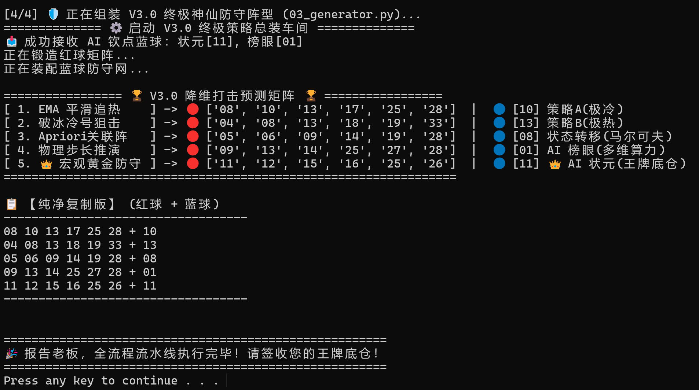

# 🚀 SSQ_Quant_Predictor   (双色球量化与 AI 预测矩阵)


- 重要提醒：**有不会的就去问AI**
- 把项目网址链接复制给大模型他会一步步教你，哪怕是0基础小白也能完美运行（推荐使用Gemini，专业在线而且情绪价值给的是真足）


> **放弃幻想，拥抱量化。**
>本项目彻底抛弃了传统“黑盒深度学习盲目预测白噪音”的低效方案，重构为一套**逻辑透明、多维特征融合、严格防守**的工业级“白盒”量化预测流水线。


---


**运行效果如下**：




---


## 💡 核心设计理念

彩票的本质是独立同分布的随机事件，但人类摇奖机的物理特性、以及号码的历史掉落序列中，隐藏着微弱的“非随机偏态”。本项目采用华尔街量化基金的“**多维策略对冲**”思想，将 AI 算力与统计学宏观约束完美结合，为您预测出 5 注期望值最高的防守底仓。

**本算法由5组红球策略和5组蓝球策略有机组合而成：**


### 1. 🔴 5 组红球策略 (The Red Matrix)

这 5 组红球策略从完全不同的数学维度出发，确保我们的防守网不留死角：

1. **EMA 平滑追热 (动量趋势)**
   - **逻辑**：利用金融界的 EMA 指数移动平均线，给近期刚开出的号码赋予极高权重。
   - **亮点**：从动量最强的 15 个号码中，强制在 3 个区间（1-11, 12-22, 23-33）各挑 2 个，既顺势追高，又防止号码极端扎堆断区。

2. **破冰冷号狙击 (均值回归)**
   - **逻辑**：金融市场里最赚钱的往往是“触底反弹的第一根阳线”。
   - **亮点**：精选 2 个遗漏极久但刚有回暖迹象的“破冰冷号”作为主攻，搭配 4 个历史出现频次最平庸的“温号”作为防守基石，奇正相辅。

3. **Apriori 关联阵 (数据挖掘)**
   - **逻辑**：把彩票历史当成超市购物小票，寻找号码间的“裙带关系”。
   - **亮点**：抽取上一期的一个号码作为“核心胆码”，然后去历史共现矩阵里，把和它同时开出概率最高的 5 个“黄金搭档”全部揪出来抱团上场。

4. **物理步长推演 (马尔可夫微调)**
   - **逻辑**：模拟摇奖机物理掉落的惯性和步长。
   - **亮点**：强制复用 1~2 个上一期的号码（重号），剩下的位置优先用上一期号码的相邻数字（斜连号）填补，纯靠历史步长概率驱动。

5. **宏观黄金防守 (大数定律过滤) 👑**
   - **逻辑**：抛弃局部趋势，站在上帝视角审视整注号码的宏观形态。
   - **亮点**：按冷热温比例初步选号后，必须通过极其严苛的安检门：和值必须在 90~130 的正态分布内、奇偶必须均衡、AC值复杂度必须达标。这是存活率最高的王牌阵型。


### 2. 🔵 5 组蓝球策略 (The Blue Matrix)

蓝球是 16 选 1，我们的 5 路诸侯分别押注了不同的概率坍缩方向：

1. **策略 A：极冷号 (均值回归)**
   - **逻辑**：死守过去 24 期里一次都没出过、遗漏最久的那个号码，赌它触底反弹。

2. **策略 B：极热号 (动量追踪)**
   - **逻辑**：追击近期最疯狂、开出频次最高的那个号码，拥抱绝对热度。

3. **状态转移：马尔可夫推演**
   - **逻辑**：查阅历史 3000 期数据，看看当上一期开出某个蓝球后，紧接着最爱掉落的下一个蓝球是谁。

4. **AI 榜眼：多维算力第二名**
   - **逻辑**：给 16 分类随机森林模型喂入奇偶、大小、跨度等高维特征，这是 AI 算出的胜率排名第二的备胎。

5. **AI 状元：多维算力第一名 👑**
   - **逻辑**：同上，这是 AI 结合所有环境切片后，算出的下一期掉落概率最高的“天选之子”。


### 3. ⚔️ 终极对冲绑定 (红 + 蓝)

为了实现期望值的最大化，流水线在最后组装时，采取了“**非对称权重分配**”：
把你最坚固的盾（**红球 5 宏观过滤**）和最锋利的矛（**蓝球 AI 状元**）绑定在一起，形成**绝对主力底仓**；其余的则分别组合，作为分散风险的火力掩护。


---


## 🧠 V3.0 核心架构剖析

（为什么是3.0呢？前两个版本是之前自己搞着玩的简陋版本所以忽略掉，直接发布3.0）

**系统由四大高内聚低耦合的模块组成，实现了彻底的解耦与极速运行：**


### 1. 🕷️ 数据获取模块 (`01_get_data.py`)

作为整个量化流水线的最前哨，负责为下游的 AI 和数学模型提供绝对纯净、实时的“弹药”：

- **逻辑**：量化预测的基石在于全量历史数据的精准对齐。本程序通过轻量级网络请求，直连全网开奖数据池，实时同步从第 1 期到最新一期的所有开奖切片。
- **亮点**：采用扁平化架构，秒级生成无冗余表头的纯净特征源文件 (`data.csv`)，实现了简易与自动化拉取。


### 2. ⚙️ 超级数据引擎 (`data_engine.py`)

不再只是简单读取历史数据，而是实时计算高级金融与统计学特征：

- **红球 EMA 动量追踪**：使用指数移动平均线计算近期强势号码，越近开出权重越大。

- **蓝球一阶马尔可夫转移矩阵**：推演号码之间的状态转移概率（上一期开 A，下一期最爱开 B）。

- **Apriori 强关联矩阵**：挖掘历史长河中喜欢“抱团开出”的黄金搭档。

- **蓝球多维特征切片**：为 AI 提取奇偶偏态、大小重心、冷号积压度、平均跨度等高维特征。


### 3. 🤖 AI 多分类决策中枢 (`02_ml_model.py`)

- 使用 `scikit-learn` 的随机森林（Random Forest）构建支持 16 分类的概率网。

- 喂入数据引擎提供的高维特征矩阵，直接预测下一期每个蓝球的独立掉落概率。

- 智能钦点并输出胜率最高的“**状元签**”与“**榜眼签**”。


### 4. 🛡️ 终极神仙防守阵型 (`03_generator.py`)

系统将上述原材料融合成 5 注互相独立、绝对互补的预测矩阵：

1. **[💥 1. EMA 平滑追热]**：红球 EMA 顺势追高 + 蓝球极冷均值回归。

2. **[💥 2. 破冰冷号狙击]**：红球寻找回暖拐点带温号基石 + 蓝球追击极限热度。

3. **[💥 3. Apriori关联阵]**：红球 Apriori 强关联抱团 + 蓝球马尔可夫物理步长推演。

4. **[💥 4. 物理步长推演]**：红球复用并推演相邻形态 + 蓝球 AI 榜眼(多维算力)。

5. **[👑 5. 宏观黄金防守]**：红球通过“和值(90~130) + 奇偶 + AC值”极严安检 + 蓝球 AI 状元(王牌底仓)。


---


## 📂 极简目录结构 (Zero Tech Debt)


项目目录十分的扁平与清爽，便于移植和新手使用：


```text

SSQ_Quant_Predictor

├── config.py             # 极简全局配置

├── 01_get_data.py           # 500彩票网实时数据抓取爬虫 (消除 SSL 警告纯净版)

├── data_engine.py     # V3.0 特征提取与量化计算引擎

├── 02_ml_model.py        # AI 特征评估与多分类概率网预测

├── 03_generator.py       # 5 大策略组装与控制台 UI 渲染输出

├── run_pipeline.bat      # Windows 用户一键全自动执行脚本

├── requirements.txt      # 环境依赖

└── README.md             # 项目说明文档

```


---


## 🚀 快速开始 (Quick Start)


### 🛠️ Step 1: 配置环境

首先安装 Anaconda 或者miniconda（网上有丰富教程），然后打开 Anaconda Prompt。

输入这行代码并回车，创建一个虚拟环境：
```bash
conda create -n lottery python=3.7
```
屏幕会滚动一阵子，然后停下来问你 `Proceed ([y]/n)?`。
这时候在键盘上敲一个字母 `y`，按回车，让它继续下载安装。

等屏幕不再滚动，光标重新闪烁时，输入这行代码激活环境：
```bash
conda activate lottery
```
你会看到命令行最前面的 `(base)` 变成了 `(lottery)`。这说明你已经成功进入了这个专门为双色球准备的虚拟环境！

*(lottery 是这个环境的名字，可自定义为自己喜欢的。*
*如果您在这一步中自定义了环境名称，请右键选择“在记事本中编辑”打开 run_pipeline.bat或者将后缀改为txt编辑，将第8行代码 set ENV_NAME=lottery 等号右边改为您自己的名字即可。*
*另，批处理代码是死脑筋，等号左右不要加空格)*


### 📥 Step 2: 克隆本项目

确定项目文件夹存放地点，比如 `D:\workspace`。
在命令行中输入以下命令进入目标目录：
```bash
cd /d D:\workspace
```

然后克隆该项目，输入以下代码并回车：
```bash
git clone https://github.com/gmskywalker/SSQ_Quant_Predictor.git
```
> **小白避坑指南**：若提示 `'git' 不是内部或外部命令`，需先去官网 ([https://git-scm.com/download/win](https://git-scm.com/download/win)) 下载 64-bit 安装包，一路 Next 安装完。然后重启 Anaconda Prompt，重新执行 `conda activate lottery` 后再来一遍即可。

克隆完成后，进入项目文件夹：
```bash
cd SSQ_Quant_Predictor
```


### ⚠️ 运行前必看提示
> **🚫 请务必关闭 VPN / 梯子 / 代理软件！**
> 本项目需要高频直连国内的“500 彩票网”拉取历史数据。如果你开启了网络代理，会导致底层网络库握手失败，引发 `ProxyError` 或 `FileNotFoundError`。
>开启网络代理也会使pip命令报错
> **运行前请确保处于纯净的国内直连网络环境下！**


### 📦Step 3: 安装依赖包

这一步相对简单，直接接着上一步操作，继续输入并回车：
```bash
pip install -r requirements.txt
```
系统会自动安装所需要的库（如果下载失败报错，请关闭你的 VPN 或代理网络）。


### ⚡ Step 4: 一键启动流水线

- **Windows 用户**：以上完成之后可以退出Anaconda,直接双击运行 `run_pipeline.bat`这个批处理程序即可，以后再次使用也是直接双击运行即可,会自动进入虚拟环境然后运行程序。

- **Mac/Linux 用户** 以及想想体验逐步运行感觉的Windows用户：
依次继续在终端执行以下命令：

```bash

python 01_get_data.py

```

```bash

python 02_ml_model.py

```

```bash

python 03_generator.py

```

> **温馨提示**：如果`01_get_data.py`出现解析错误，看看网页 http://datachart.500.com/ssq/history/newinc/history.php 是否可以正常访问，再关闭VPN和网络代理，这是爬虫数据来源

执行完毕后，系统将展示优雅的控制台 UI，并在最下方提供【纯净复制版】供你直接提取 5 注预测号码！


---


## ⚠️ 免责声明 (Disclaimer)

1. 彩票开奖具有绝对的随机性，任何算法、特征工程或机器学习均无法保证 100% 的准确率。

2. 本项目初衷为探讨 **Python 数据清洗、特征工程提取、机器学习分类与量化对冲思想** 在随机时间序列中的应用。

3. **请理性看待预测结果，切勿沉迷或投入超出日常娱乐承受能力的资金。代码作者不对任何直接或间接的经济损失负责！**

4. 本项目完全开源，代码作者不收取任何费用，当然，要是有朝一日有人真用这玩意中了500万想分我一杯羹我是欣然接受的：）
